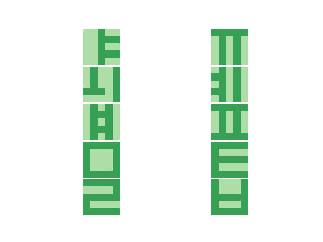
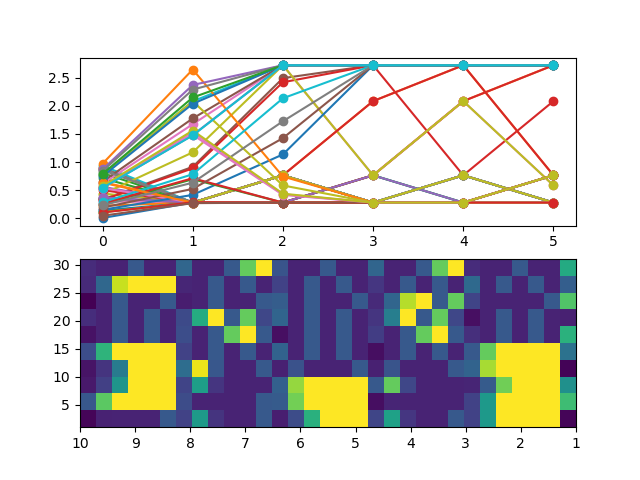
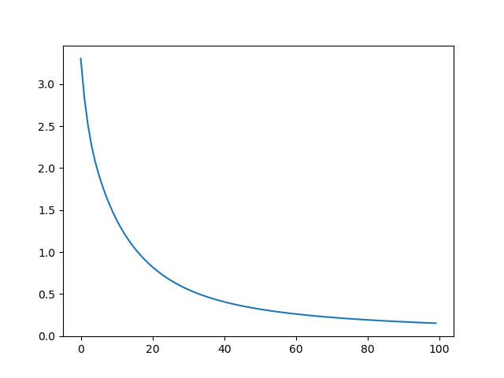
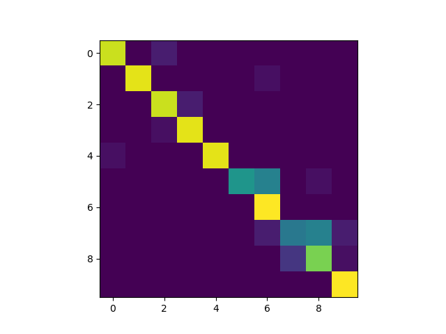

# First_test_on_reservoir_computing_with_memristors
Reproduction of figure 3 of In-sensor reservoir computing for language learning via two-dimensional memristors

<table>
  <tr>
    <td> Training Letters</td>
     <td> Weights</td>
     <td>Losses</td>
  </tr>
  <tr>
    <td valign="top"></td>
    <td valign="top"></td>
    <td valign="top"></td>
  </tr>
 </table>

## Confussion Matrix
 
